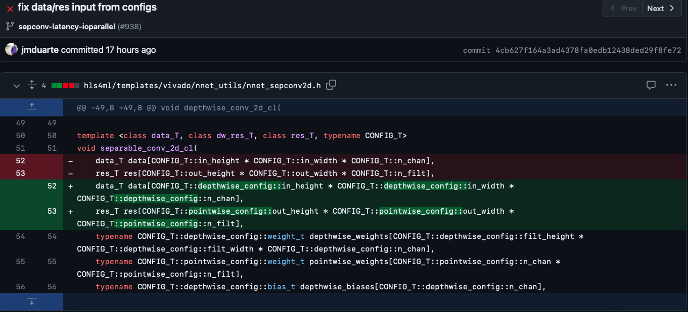

# Issues Found and Resolution as I Explore the HLS4ML package.
## Calling a Missing Member in a Function:
```bash
ERROR: [HLS 200-70] Compilation errors found: In file included from firmware/smartpixels.cpp:1: ...
.
.
.
firmware/nnet_utils/nnet_sepconv2d.h:51:6: note: candidate template ignored: substitution failure [with data_T = ap_fixed<12, 11, 5, 3, 0>, dw_res_T = ap_fixed<12, 11, 5, 3, 0>, res_T = ap_fixed<12, 11, 5, 3, 0>, CONFIG_T = config2]
void separable_conv_2d_cl(
     ^
1 error generated.
Failed during preprocessing.
    while executing
"source build_prj.tcl"
    ("uplevel" body line 1)
    invoked from within
"uplevel \#0 [list source $arg] "
```
The error here was related to calling a missing member inside the function. The image below shows the fixes. Basically, we had to specify it to into a `config`, in this case `depthwise_config`, to retrieve `in_height`, `in_width`,etc. Then, same case for `out_width` and other members in `pointwise_config`.

 

## Adding a New Header File for a New Layer (SepConv2D):

The changes made to support the SepConv2D layer, or basically, just to make the hls conversion work are shown on [this github commit](https://github.com/fastmachinelearning/hls4ml/commit/4e958294dbea47ec4e930c20738f945faf357a51).
Essentially, we had to add the name of the header file in  
`hls4ml/backends/vivado/passes/convolution_templates.py` and create that respective header file in ` 
hls4ml/templates/vivado/nnet_utils/`.
